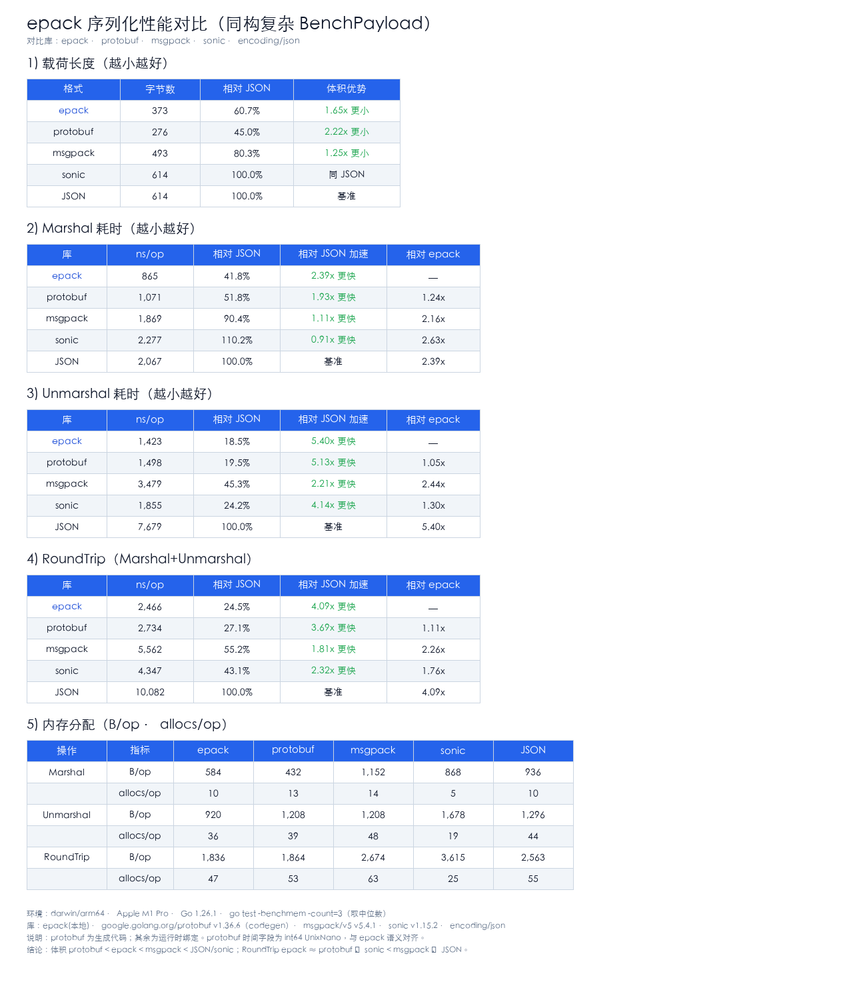

# 性能测试

[English](BENCHMARK.md) | 中文

以下数据测于 **darwin/arm64（Apple M1 Pro）、Go 1.26.1**，使用同一复杂嵌套 payload（`BenchPayload`：map、切片、嵌套结构体、`time.Time`/UnixNano、浮点、布尔等）。

命令形式：`go test -bench=... -benchmem -count=3`（取中位数）。

对比库：

| 库 | 说明 |
|----|------|
| **epack** | 二进制，运行时反射 + 模板缓存 |
| **protobuf** | 二进制，生成代码（`google.golang.org/protobuf`） |
| **msgpack** | 二进制，运行时（`github.com/vmihailenco/msgpack/v5`） |
| **sonic** | JSON 文本，JIT/SIMD（`github.com/bytedance/sonic`） |
| **encoding/json** | JSON 文本，标准库 |

> 公平性：protobuf 为 codegen；其余为运行时绑定。protobuf 时间字段使用 `int64` UnixNano，与 epack 语义对齐。

## 总览图



## 载荷体积

| 格式 | 字节 | 相对 JSON |
|------|-----:|----------:|
| protobuf | 276 | 44.9% |
| epack | 373 | 60.7% |
| msgpack | 493 | 80.3% |
| sonic | 614 | 100% |
| JSON | 614 | 100% |

## Marshal（ns/op）

| 库 | ns/op | 相对 JSON | B/op | allocs/op |
|----|------:|----------:|-----:|----------:|
| epack | 865 | **2.39x** | 584 | 10 |
| protobuf | 1,071 | 1.93x | 432 | 13 |
| msgpack | 1,869 | 1.11x | 1,152 | 14 |
| JSON | 2,067 | 1.00x | 936 | 10 |
| sonic | 2,277 | 0.91x | 868 | 5 |

## Unmarshal（ns/op）

| 库 | ns/op | 相对 JSON | B/op | allocs/op |
|----|------:|----------:|-----:|----------:|
| epack | 1,423 | **5.40x** | 920 | 36 |
| protobuf | 1,498 | 5.13x | 1,208 | 39 |
| sonic | 1,855 | 4.14x | 1,678 | 19 |
| msgpack | 3,479 | 2.21x | 1,208 | 48 |
| JSON | 7,679 | 1.00x | 1,296 | 44 |

## RoundTrip（Marshal + Unmarshal）

| 库 | ns/op | 相对 JSON | B/op | allocs/op |
|----|------:|----------:|-----:|----------:|
| epack | 2,466 | **4.09x** | 1,836 | 47 |
| protobuf | 2,734 | 3.69x | 1,864 | 53 |
| sonic | 4,347 | 2.32x | 3,615 | 25 |
| msgpack | 5,562 | 1.81x | 2,674 | 63 |
| JSON | 10,082 | 1.00x | 2,563 | 55 |

## 结论摘要

1. **体积**：protobuf < epack < msgpack < JSON/sonic  
2. **速度**：本场景下 epack 整体最快，且接近 protobuf（无 codegen）  
3. **相对 JSON**：RoundTrip 约 4.1x，Unmarshal 约 5.4x  
4. **相对 sonic**：RoundTrip 约 1.8x；部分路径 sonic allocs 更少  
5. **相对 msgpack**：epack 更小更快  
6. 数据与机器相关，引用前请本机复测  

## 仓库内 epack vs JSON

```bash
go test -bench='Benchmark(Marshal|Unmarshal|RoundTrip)_(Epack|JSON)' -benchmem .
```
